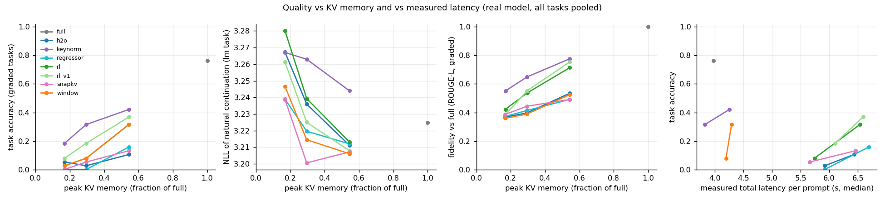
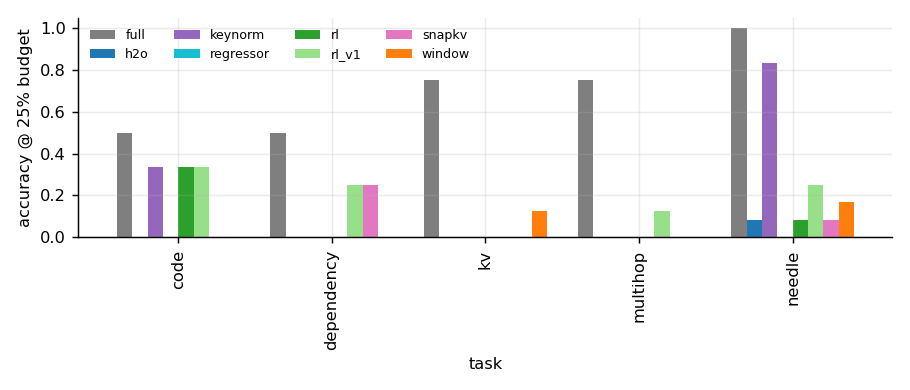
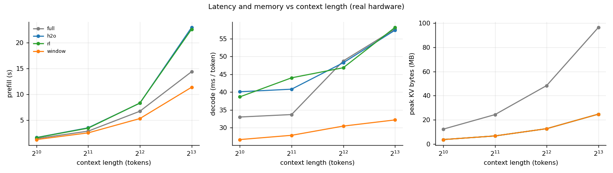
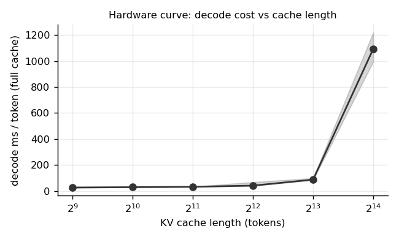
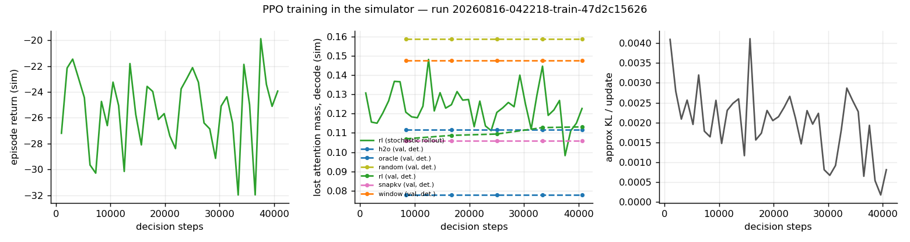
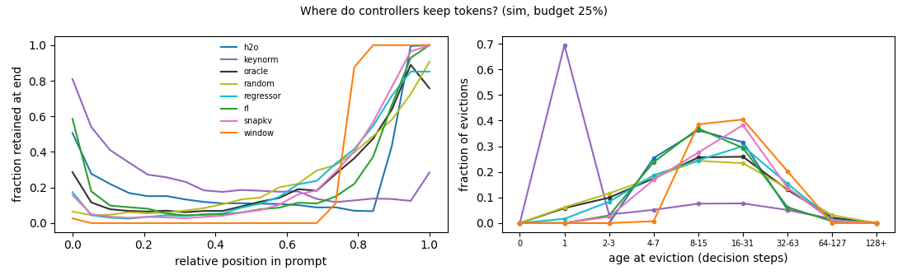
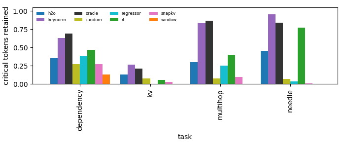
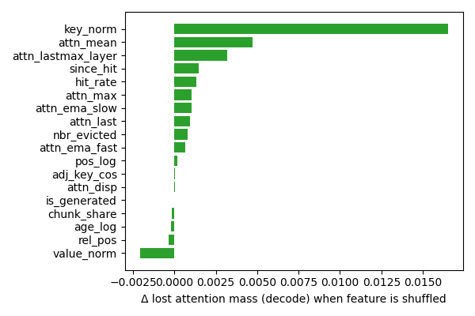

# kvrl — an RL controller for the Transformer KV cache

[](https://github.com/sunkalpchandra/kvrl/actions/workflows/ci.yml)
[](https://sunkalpchandra.github.io/kvrl/)

**Can a reinforcement-learning controller learn which information a Transformer should
retain or evict from its KV cache during long-context inference — reducing memory and
inference cost while preserving downstream quality?**

kvrl is an end-to-end systems project that answers this on real hardware: a real Hugging Face
model whose K/V tensors are physically evicted mid-inference by a learned policy, a
trace-replay simulator that trains that policy with PPO on millions of cheap transitions,
eight heuristic baselines and an oracle behind one interface, a long-context task suite with
programmatically known answers, honest latency/memory measurement, and an interactive
dashboard. Every number in this repository comes from a tracked run under `runs/`
(commit, config, seed, device); nothing is typed by hand.

```
python demo.py            # full cache vs learned cache, side by side, on a real 4K-token prompt
```

> Status: v1 vertical slice complete (binary KEEP/EVICT under a hard budget, PPO in the
> simulator, real-inference integration). Results below are regenerated by
> `scripts/make_report.py` from `runs/`; see `docs/results.md`.

---

## 1. Why the KV cache is the problem

Autoregressive decoding caches the key and value vectors of every past token in every layer
so that each new token attends over the whole context in O(n) instead of recomputing O(n²).
The cache grows linearly with context: for Qwen2.5-0.5B (24 layers, 2 KV heads, head dim 64,
fp16) that is **12,288 bytes per token** — 96 MB at 8K, 384 MB at 32K, and for a 70B-class
model hundreds of GB at long context. Worse, *every decode step reads the whole cache*, so
decode latency grows with cache length too (see the measured hardware curve in
`docs/figures/decode_curve.png`).

Most of that cache is never looked at again. Attention is sparse: a handful of tokens (the
first "sink" tokens, the recent window, and a small set of content-relevant tokens) receive
most of the mass. The question is *which* tokens matter for the future — and that is a
sequential decision problem under uncertainty, because eviction is irreversible.

## 2. What the controller does

```
tokens ─▶ chunked prefill (64 tokens/step) ─▶ K,V appended to the cache
                                                    │
                            ┌───────────────────────▼──────────────────────┐
                            │  KVCacheController.decide(state, budget)      │
                            │  full | window | random | snapkv | h2o | tova │
                            │  keynorm | hybrid | regressor | oracle | RL   │
                            └───────────────────────┬──────────────────────┘
                                                    │ keep-set (slots)
                                     physical eviction: index_select on every layer's K/V
                                                    │
                                              next tokens
```

After every chunk of C = 64 tokens (during prefill) and every 64 generated tokens (during
decode) the controller sees a `CacheState` — per-slot position, age, attention received during
the last chunk (layer-mean and layer-max), cumulative attention, key/value norms, adjacent-key
cosine — plus the budget, and returns the set of slots to keep. The engine physically removes
the rest from all 24 layers, keeps absolute positions for RoPE, and continues. Budget = 100 %
reproduces Hugging Face greedy generation token for token (tested); physical eviction is
numerically identical to masking the same tokens (tested against a masked-reference oracle).

The controller never sees the future. It must predict *expected future usefulness* from
what it has observed — that is the whole game.

## 3. RL formulation (v1)

| item | choice |
|---|---|
| **step** | one decision per chunk of 64 tokens; the cache holds *n* slots and must shrink to the budget *B*, so exactly *m = n − B* tokens are evicted (hard budget → memory is a controlled variable; the Pareto frontier comes from sweeping *B*) |
| **episode** | one prompt + its full-cache greedy continuation |
| **protected** | 4 attention-sink slots + the current chunk are never evicted (they count against *B*) |
| **state** | 18 per-token features + 8 globals from one shared `FeatureState` (identical code path in the simulator and in real inference): age, relative/log position, attention received last chunk, fast/slow EMAs, mean/max, layer-max and layer dispersion, top-5 % hit rate and recency, chunk share, key/value norms, adjacent-key cosine, fraction of the token's chunk already evicted; globals: budget fraction, occupancy, evict fraction, context length, step fraction, phase, remaining generation, chunk attention entropy. Attention values pass through a length-invariant transform φ(a; n) = log1p(a·n)/log1p(32768) |
| **action** | an *ordered set* of *m* tokens sampled without replacement from softmax(scores) — Plackett–Luce via Gumbel-top-k, with exact per-slot log-probabilities and a Rao–Blackwellised entropy estimator (`kvrl/rl/sampler.py`, 9 unit tests incl. exhaustive Σπ = 1 and sampling-frequency checks) |
| **reward** | each eviction is charged its discounted *future* full-cache attention mass, r = −Σ_{j∈evicted} Σ_{k'>k} γ^{k'−k} A_{k'}(j) / r_scale, which telescopes to the delayed "lost attention mass" reward (unit-tested identity) with far lower variance; plus a terminal term for task-critical tokens retained on labelled episodes. Quality-only in v1: memory and latency are fixed by the budget |
| **policy** | MLP 26→128→128→1 (20,097 parameters; DeepSets and induced-set-attention variants for the architecture ablation); value net with mean⊕max pooling and three simulator-only privileged inputs (asymmetric critic) |
| **algorithm** | PPO with per-slot clipped ratios and a shared advantage, separate gradient clipping for policy/value, GAE, target-KL early stop |
| **evaluation policy** | deterministic top-m by score |

Why lost attention mass? For a single layer with output o = Σ α_j v_j, evicting a set with
mass ℓ and renormalising gives ‖o − o′‖ ≤ 2ℓ·max‖v‖ — the perturbation is first-order in the
lost mass (the H2O argument). Whether that proxy transfers to real degradation is *measured*,
not assumed: `scripts/eproxy.py` reports the Spearman correlation between simulator lost mass
and the real model's ΔNLL across prompts × controllers × budgets (section 6).

## 4. Two environments

**Env A — trace-replay simulator (`kvrl/sim`).** `kvrl.collect` runs the real model once per
prompt with a full cache and a custom attention implementation that accumulates, with bounded
memory, the attention mass every cache slot receives per 64-query chunk (layer-mean and
layer-max), plus key/value norms and adjacent-key cosines. A trace is ~0.15 MB at 2K tokens and
~1 MB at 8K (`.npz`). The simulator replays a trace under any controller: attention on the
retained set is renormalised (what an evicted-cache model approximately sees), rewards use
the recorded future, and heuristics run unchanged on the same `CacheState`. Millions of
transitions per hour on a laptop CPU.

**Env B — real inference (`kvrl/engine.py`).** The same controller object drives the real
model: the `kvrl` attention function is registered with transformers 5.x, statistics are
captured in a "dual" pass whose output is bit-identical to plain SDPA, positions are passed
explicitly so RoPE stays correct after compaction, and every decision physically shrinks the
cache. Latency is split into model / controller / cache-ops so controller overhead is never
hidden.

## 5. Baselines and tasks

Controllers: **full**, **window** (StreamingLLM: sinks + recent), **random**, **snapkv**
(last-chunk attention), **h2o** (cumulative attention heavy hitters + recent half), **tova**,
**keynorm**, **hybrid** (recency + attention), **regressor** (the honest ML baseline: same 26
features, same MLP, trained supervised to predict future attention mass, then top-k), **oracle**
(simulator only: evict least future mass), and **rl**.

Tasks (`kvrl/eval/tasks.py`, seeded, with the *critical* character spans recorded so tokens can
be labelled catastrophically important vs forgettable): needle-in-a-haystack at controlled
depth, key→value retrieval among structured distractors, two-hop entity chains, synthetic
variable-assignment dependency chains, questions about this repository's own source code
(AST-derived answers), and natural-text continuation (NLL) using public-domain books as
filler. Metrics: accuracy, ΔNLL, output fidelity vs the full-cache generation (ROUGE-L,
prefix agreement), KV bytes (peak/final), latency breakdown, paired bootstrap CIs per prompt.

## 6. Findings (real model, Apple M2, fp16 — every number from a tracked run)

The evaluation is 42 prompts (38 graded) across needle / kv / multihop / dependency / code / lm at
2K–4K tokens, three budgets, 924 real runs (E-017); the full-cache model scores 0.763.

**What the learned controller does well.** RL (v1) beats every attention-based heuristic
and the supervised regressor on the real model. Paired per-prompt comparisons at 25 % and 50 %
budget: RL vs H2O +0.16 / +0.26 accuracy and +0.16 / +0.22 fidelity (all significant), RL vs
SnapKV +0.13 / +0.24 accuracy and +0.11 / +0.26 fidelity (significant), RL vs the supervised
regressor +0.18 / +0.21 accuracy (significant), RL vs sliding window +0.16 / +0.23 fidelity
(significant). On natural-text continuation (lm task) RL matches the full cache (NLL 3.225 vs
3.225 at 25 %). Controller overhead is 0.2 s per prompt (≈4 % of model time at 2K, dominated
by feature computation; the decision itself is ~1 ms). It generalises beyond its training
length: trained on ≤ 4K, it keeps 8K–16K needles at 50 % budget where H2O/SnapKV/window score 0
(E-010).

**What it does not beat.** A one-line heuristic — evict the tokens with the largest key norm —
has higher accuracy (0.316 vs 0.184 at 25 %) and fidelity (0.649 vs 0.552). The difference is
*not* statistically significant at n = 38 (accuracy −0.13 [−0.29, +0.05]), and keynorm is the
worst controller on natural-text NLL (3.263), but the point estimates are consistent across
budgets and we report them as they are. Mechanism (failure analysis + a token-level probe):
in streaming eviction anything that ranks by attention received so far drops a needle before
the question arrives; needle tokens sit at the 1st–10th percentile of key norm, so keynorm keeps
them trivially. RL discovered the same signal — key norm is its most important feature by
permutation importance — but it trades some needles for hot tokens because its reward is
attention mass.

**What we tried, honestly.** (i) A dense penalty for evicting task-critical tokens (E-012): no
change — with one shared advantage per 64-token decision the credit for a single eviction is
diluted. (ii) Per-slot counterfactual credit assignment (E-014): the simulator metrics moved
substantially (critical retention 0.26 → 0.39, answer-token retention 0.50 → 0.63, best lost
mass of any controller, policy entropy 6.2 → 4.4 nats) — but real accuracy *fell* (0.184 →
0.079 at 25 %); a sim→real probe shows the simulator is faithful (retained-set Jaccard 0.8–0.85
on identical prompts), so this is the objective, not the simulator: attention-mass reward
plus a token-fraction penalty is not task accuracy. (iii) A stronger penalty and answer-token
weighting (E-015, E-016) did not help. v1 remains the shipped policy; the others are in
`checkpoints/` and the tables.

**Proxy validation.** The simulator's layer-mean lost attention mass correlates only weakly
with real ΔNLL (Spearman 0.36); the layer-max variant correlates much better (0.59; 0.65–0.71
within each budget), which is why the reward uses layer-max attention (D-009). Averaging over
layers hides the few heads that do retrieval.

**Hardware.** KV memory is bounded exactly by the budget (peak = budget + one chunk). On this
0.5B model decode is dominated by weight reads, so latency gains from a smaller cache are
modest at ≤ 8K (see the measured decode-vs-cache-length curve). Two things we hit were not the
model: on MPS the caching allocator kept every freed attention buffer of the chunked prefill
(7.7 GB reserved vs 0.9 GB allocated after 8K tokens on an 8 GB machine), the OS swapped, and
full-cache decode at 8K crawled to ~1.2 s/token — releasing the pool every 8 chunks fixed it
(57 ms/token) with no prefill cost (BUG-003, D-010); and an earlier "16K cliff" turned out to be
a `deepcopy` of the whole cache in our own measurement harness (BUG-004).

## 7. Results tables and figures

Regenerate with `python scripts/make_report.py` (figures in `docs/figures/`, tables in
`docs/results.md`); `scripts/update_readme_results.py` copies them below verbatim.







Failure analysis (simulator, val traces; `docs/failure_analysis.md`): where controllers keep
tokens, critical-token retention by task, and RL feature permutation importance.





<!-- RESULTS:BEGIN -->
### Real-model evaluation — run `20260816-041435-eval-cc4cddaae0` (commit `902eebbc`, Apple MPS, 494 rows)

| controller | budget | n | accuracy | NLL | fidelity | KV peak | model s | ctrl s | compact s |
|---|---|---|---|---|---|---|---|---|---|
| h2o | 50% | 26 | 0.091 | 0.840 | 0.553 | 54% | 5.91 | 0.009 | 0.108 |
| keynorm | 50% | 26 | 0.409 | 0.678 | 0.745 | 54% | 3.20 | 0.006 | 0.112 |
| random | 50% | 26 | 0.000 | 0.824 | 0.506 | 54% | 3.36 | 0.008 | 0.124 |
| rl | 50% | 26 | 0.364 | 0.690 | 0.747 | 54% | 5.96 | 0.062 | 0.119 |
| snapkv | 50% | 26 | 0.136 | 0.737 | 0.475 | 54% | 5.80 | 0.007 | 0.123 |
| window | 50% | 26 | 0.227 | 0.800 | 0.522 | 54% | 3.45 | 0.007 | 0.149 |
| h2o | 25% | 26 | 0.045 | 0.941 | 0.437 | 30% | 4.85 | 0.013 | 0.178 |
| keynorm | 25% | 26 | 0.273 | 0.763 | 0.635 | 30% | 3.13 | 0.009 | 0.167 |
| random | 25% | 26 | 0.000 | 0.914 | 0.331 | 30% | 3.28 | 0.011 | 0.172 |
| rl | 25% | 26 | 0.136 | 0.783 | 0.521 | 30% | 4.75 | 0.080 | 0.172 |
| snapkv | 25% | 26 | 0.000 | 0.868 | 0.355 | 30% | 5.02 | 0.010 | 0.161 |
| window | 25% | 26 | 0.045 | 0.908 | 0.366 | 30% | 3.40 | 0.010 | 0.226 |
| h2o | 12% | 26 | 0.045 | 0.965 | 0.382 | 17% | 3.99 | 0.015 | 0.227 |
| keynorm | 12% | 26 | 0.227 | 0.803 | 0.575 | 17% | 2.97 | 0.012 | 0.226 |
| random | 12% | 26 | 0.000 | 0.909 | 0.308 | 17% | 3.27 | 0.011 | 0.198 |
| rl | 12% | 26 | 0.045 | 0.880 | 0.387 | 17% | 4.23 | 0.067 | 0.213 |
| snapkv | 12% | 26 | 0.000 | 0.912 | 0.346 | 17% | 4.35 | 0.010 | 0.197 |
| window | 12% | 26 | 0.000 | 0.944 | 0.316 | 17% | 3.26 | 0.012 | 0.261 |
| full | 100% | 26 | 0.591 | 0.612 | 1.000 | 100% | 3.53 | 0.000 | 0.000 |

#### Accuracy by task (25% budget)

| task       |   full |   h2o |   keynorm |   random |   rl |   snapkv |   window |
|:-----------|-------:|------:|----------:|---------:|-----:|---------:|---------:|
| code       |   0.75 |  0.25 |      0.25 |     0.00 | 0.25 |     0.00 |     0.00 |
| dependency |   0.00 |  0.00 |      0.00 |     0.00 | 0.00 |     0.00 |     0.00 |
| kv         |   0.25 |  0.00 |      0.00 |     0.00 | 0.00 |     0.00 |     0.00 |
| multihop   |   0.75 |  0.00 |      0.00 |     0.00 | 0.25 |     0.00 |     0.00 |
| needle     |   1.00 |  0.00 |      0.83 |     0.00 | 0.17 |     0.00 |     0.17 |

#### Paired comparisons (per prompt, bootstrap 95% CI)

| controller | budget | vs | metric | mean diff (ctrl − vs) | 95% CI | ctrl better on | n | significant |
|---|---|---|---|---|---|---|---|---|
| h2o | 12% | full | nll | +0.3525 | [+0.2000, +0.5368] | 88% | 26 | yes |
| rl | 12% | h2o | nll | -0.0847 | [-0.2478, +0.0337] | 54% | 26 | no |
| rl | 12% | h2o | accuracy | +0.0000 | [-0.1364, +0.1364] | 5% | 22 | no |
| h2o | 25% | full | nll | +0.3287 | [+0.1664, +0.5202] | 81% | 26 | yes |
| rl | 25% | h2o | nll | -0.1576 | [-0.2996, -0.0298] | 69% | 26 | yes |
| rl | 25% | h2o | accuracy | +0.0909 | [+0.0000, +0.2273] | 9% | 22 | no |
| h2o | 50% | full | nll | +0.2274 | [+0.1077, +0.3819] | 77% | 26 | yes |
| rl | 50% | h2o | nll | -0.1495 | [-0.3148, -0.0253] | 65% | 26 | yes |
| rl | 50% | h2o | accuracy | +0.2727 | [+0.0909, +0.4545] | 27% | 22 | yes |
| keynorm | 12% | full | nll | +0.1905 | [+0.0815, +0.3185] | 77% | 26 | yes |
| rl | 12% | keynorm | nll | +0.0772 | [-0.0784, +0.2335] | 31% | 26 | no |
| rl | 12% | keynorm | accuracy | -0.1818 | [-0.3648, +0.0000] | 5% | 22 | no |
| keynorm | 25% | full | nll | +0.1511 | [+0.0425, +0.2812] | 77% | 26 | yes |
| rl | 25% | keynorm | nll | +0.0200 | [-0.1234, +0.1747] | 54% | 26 | no |
| rl | 25% | keynorm | accuracy | -0.1364 | [-0.3182, +0.0455] | 5% | 22 | no |
| keynorm | 50% | full | nll | +0.0653 | [+0.0168, +0.1320] | 69% | 26 | yes |
| rl | 50% | keynorm | nll | +0.0126 | [-0.0655, +0.0782] | 62% | 26 | no |
| rl | 50% | keynorm | accuracy | -0.0455 | [-0.1830, +0.0909] | 5% | 22 | no |
| random | 12% | full | nll | +0.2965 | [+0.1780, +0.4274] | 92% | 26 | yes |
| rl | 12% | random | nll | -0.0287 | [-0.1433, +0.0719] | 46% | 26 | no |
| rl | 12% | random | accuracy | +0.0455 | [+0.0000, +0.1364] | 5% | 22 | no |
| random | 25% | full | nll | +0.3018 | [+0.1599, +0.4616] | 77% | 26 | yes |
| rl | 25% | random | nll | -0.1307 | [-0.2922, +0.0310] | 62% | 26 | no |
| rl | 25% | random | accuracy | +0.1364 | [+0.0000, +0.2727] | 14% | 22 | no |
| random | 50% | full | nll | +0.2113 | [+0.1153, +0.3241] | 81% | 26 | yes |
| rl | 50% | random | nll | -0.1335 | [-0.2711, -0.0082] | 73% | 26 | yes |
| rl | 50% | random | accuracy | +0.3636 | [+0.1818, +0.5909] | 36% | 22 | yes |
| rl | 12% | full | nll | +0.2678 | [+0.1548, +0.3875] | 92% | 26 | yes |
| rl | 25% | full | nll | +0.1711 | [+0.0831, +0.2782] | 65% | 26 | yes |
| rl | 50% | full | nll | +0.0778 | [+0.0190, +0.1447] | 50% | 26 | yes |
| snapkv | 12% | full | nll | +0.2999 | [+0.1587, +0.4576] | 85% | 26 | yes |
| rl | 12% | snapkv | nll | -0.0321 | [-0.1502, +0.0691] | 42% | 26 | no |
| rl | 12% | snapkv | accuracy | +0.0455 | [+0.0000, +0.1364] | 5% | 22 | no |
| snapkv | 25% | full | nll | +0.2554 | [+0.1430, +0.3737] | 77% | 26 | yes |
| rl | 25% | snapkv | nll | -0.0843 | [-0.2226, +0.0576] | 62% | 26 | no |
| rl | 25% | snapkv | accuracy | +0.1364 | [+0.0000, +0.2727] | 14% | 22 | no |
| snapkv | 50% | full | nll | +0.1244 | [+0.0437, +0.2231] | 62% | 26 | yes |
| rl | 50% | snapkv | nll | -0.0465 | [-0.1492, +0.0475] | 58% | 26 | no |
| rl | 50% | snapkv | accuracy | +0.2273 | [-0.0455, +0.4545] | 32% | 22 | no |
| window | 12% | full | nll | +0.3317 | [+0.2095, +0.4721] | 92% | 26 | yes |
| rl | 12% | window | nll | -0.0639 | [-0.1854, +0.0401] | 50% | 26 | no |
| rl | 12% | window | accuracy | +0.0455 | [+0.0000, +0.1364] | 5% | 22 | no |
| window | 25% | full | nll | +0.2954 | [+0.1840, +0.4224] | 85% | 26 | yes |
| rl | 25% | window | nll | -0.1242 | [-0.2523, -0.0002] | 69% | 26 | yes |
| rl | 25% | window | accuracy | +0.0909 | [-0.0909, +0.2727] | 14% | 22 | no |
| window | 50% | full | nll | +0.1873 | [+0.0637, +0.3267] | 54% | 26 | yes |
| rl | 50% | window | nll | -0.1095 | [-0.2679, +0.0369] | 58% | 26 | no |
| rl | 50% | window | accuracy | +0.1364 | [-0.1364, +0.4091] | 27% | 22 | no |

### Latency / memory — run `20260816-062653-bench-592800b64f` (Apple MPS, medians of 3 repeats)

| context | controller | budget | prefill s | decode ms/tok | controller s | compact s | KV peak | peak alloc MB |
|---|---|---|---|---|---|---|---|---|
| 1024 | full | 100% | 1.40 | 33.0 | 0.000 | 0.000 | 100% | 973 |
| 1024 | h2o | 25% | 1.60 | 40.1 | 0.003 | 0.077 | 30% | 955 |
| 1024 | rl | 25% | 1.58 | 38.7 | 0.012 | 0.072 | 30% | 955 |
| 1024 | window | 25% | 1.21 | 26.6 | 0.002 | 0.058 | 30% | 960 |
| 2048 | full | 100% | 2.84 | 33.7 | 0.000 | 0.000 | 100% | 973 |
| 2048 | h2o | 25% | 3.49 | 40.8 | 0.006 | 0.110 | 28% | 962 |
| 2048 | rl | 25% | 3.43 | 44.0 | 0.025 | 0.113 | 28% | 962 |
| 2048 | window | 25% | 2.51 | 27.8 | 0.004 | 0.103 | 28% | 972 |
| 4096 | full | 100% | 6.70 | 48.8 | 0.000 | 0.000 | 100% | 993 |
| 4096 | h2o | 25% | 8.27 | 48.3 | 0.018 | 0.240 | 26% | 973 |
| 4096 | rl | 25% | 8.29 | 46.8 | 0.069 | 0.249 | 26% | 973 |
| 4096 | window | 25% | 5.28 | 30.4 | 0.010 | 0.233 | 26% | 973 |
| 8192 | full | 100% | 14.36 | 57.7 | 0.000 | 0.000 | 100% | 1042 |
| 8192 | h2o | 25% | 22.95 | 57.4 | 0.062 | 0.589 | 26% | 975 |
| 8192 | rl | 25% | 22.60 | 58.2 | 0.287 | 0.612 | 26% | 975 |
| 8192 | window | 25% | 11.35 | 32.2 | 0.022 | 0.426 | 26% | 974 |

Fitted decode cost model (pre-cliff points): 19.58 ms/token + 8.003 ms per 1K cached tokens (R² = 0.945, 5 points; excluded beyond the memory cliff: [16384]).


#### Decode cost vs cache length (full cache)

| cache length | decode ms/tok (median) | IQR |
|---|---|---|
| 512 | 27.8 | 26.6–28.7 |
| 1024 | 30.3 | 29.8–30.7 |
| 2048 | 33.2 | 33.1–34.1 |
| 4096 | 42.3 | 39.9–68.9 |
| 8192 | 88.2 | 86.1–99.5 |
| 16384 | 1092.5 | 994.1–1219.1 |

### PPO training — run `20260816-032826-train-d115d477aa`

- updates 58, decision steps 60452, episodes 1837, train time 2567.7 s, policy params 20097
- best val lost-mass (decode, sim): 0.10111077626546223

Sim lost-mass (decode) on val traces, deterministic policies:

| controller   |   0.125 |   0.25 |    0.5 |
|:-------------|--------:|-------:|-------:|
| h2o          |  0.1568 | 0.1116 | 0.0576 |
| oracle       |  0.1189 | 0.0777 | 0.0344 |
| random       |  0.1894 | 0.1590 | 0.0985 |
| rl           |  0.1476 | 0.1036 | 0.0521 |
| snapkv       |  0.1528 | 0.1058 | 0.0515 |
| window       |  0.1805 | 0.1476 | 0.1016 |

### Additional evaluation — run `20260816-052257-eval-b8bf49f28b` (needle@8192×2, lm@8192×1, needle@16384×1; 52 rows)

| controller | budget | n | accuracy | NLL | fidelity | KV peak | model s |
|---|---|---|---|---|---|---|---|
| full | 100% | 4 | 1.000 | 0.817 | 1.000 | 100% | 40.6 |
| h2o | 12% | 4 | 0.000 | 1.774 | 0.167 | 13% | 17.6 |
| h2o | 25% | 4 | 0.000 | 1.373 | 0.191 | 26% | 25.4 |
| h2o | 50% | 4 | 0.000 | 1.608 | 0.495 | 51% | 60.6 |
| rl | 12% | 4 | 0.000 | 1.332 | 0.439 | 13% | 18.6 |
| rl | 25% | 4 | 0.667 | 0.933 | 0.970 | 26% | 23.3 |
| rl | 50% | 4 | 1.000 | 0.835 | 1.000 | 51% | 34.9 |
| snapkv | 12% | 4 | 0.000 | 1.566 | 0.095 | 13% | 18.3 |
| snapkv | 25% | 4 | 0.000 | 1.388 | 0.281 | 26% | 23.7 |
| snapkv | 50% | 4 | 0.000 | 1.669 | 0.563 | 51% | 51.2 |
| window | 12% | 4 | 0.000 | 1.276 | 0.037 | 13% | 10.2 |
| window | 25% | 4 | 0.000 | 1.260 | 0.037 | 26% | 11.2 |
| window | 50% | 4 | 0.000 | 1.248 | 0.037 | 51% | 19.2 |

Per prompt length (accuracy):

|                   |   ('full', 1.0) |   ('h2o', 0.125) |   ('h2o', 0.25) |   ('h2o', 0.5) |   ('rl', 0.125) |   ('rl', 0.25) |   ('rl', 0.5) |   ('snapkv', 0.125) |   ('snapkv', 0.25) |   ('snapkv', 0.5) |   ('window', 0.125) |   ('window', 0.25) |   ('window', 0.5) |
|:------------------|----------------:|-----------------:|----------------:|---------------:|----------------:|---------------:|--------------:|--------------------:|-------------------:|------------------:|--------------------:|-------------------:|------------------:|
| ('needle', 8100)  |               1 |                0 |               0 |              0 |               0 |              0 |             1 |                   0 |                  0 |                 0 |                   0 |                  0 |                 0 |
| ('needle', 8371)  |               1 |                0 |               0 |              0 |               0 |              1 |             1 |                   0 |                  0 |                 0 |                   0 |                  0 |                 0 |
| ('needle', 16531) |               1 |                0 |               0 |              0 |               0 |              1 |             1 |                   0 |                  0 |                 0 |                   0 |                  0 |                 0 |
<!-- RESULTS:END -->

Measured facts that shaped the implementation (Apple M2, 8 GB, torch 2.13, transformers 5.15):

- fp16 is 2.6× faster than bf16 on this MPS build (prefill 1751 vs 668 tok/s; decode 23 vs 50 ms/token at 2K context) → fp16 default on MPS.
- `scaled_dot_product_attention(enable_gqa=True)` is 4–25× faster than expanding K/V for grouped-query attention on MPS (decode at 8K: 0.15 vs 4.06 ms per layer) with bit-identical output.
- Capturing attention statistics (the "dual" path) costs ≈ 3× the fused attention at 2K context; it is on only for attention-based controllers and reported separately.

## 8. Limitations (honest)

- One small model on one laptop: absolute memory savings are small by construction
  (96 MB of KV at 8K vs ~1 GB of weights); what transfers is the ratio and the mechanism.
- v1 is binary keep/evict under a hard budget with a single global policy shared across
  layers; merging/compression, per-layer/per-head policies and learned occupancy are the
  documented upgrade path (`.claude/context/ML_SPEC.md`), not shipped features.
- The reward is a proxy (attention mass); its validity is measured (`scripts/eproxy.py`), not
  assumed, and it can hide a few retrieval heads (layer-max variant is an ablation).
- Batch size 1; contexts up to 8K–16K are practical here (32K only via chunked prefill).
- Latency numbers on this machine are noisy (memory pressure from other apps; swap in use);
  the harness reports medians and IQRs over repeats. Attention-statistics controllers (H2O,
  SnapKV, RL) pay for the statistics pass (~1.5–2× prefill time vs the plain path here);
  key-norm and window do not.
- The evaluation is small (26 prompts, 22 graded) because each real run costs seconds to
  minutes on this machine; several tasks are at the 0.5B model's ceiling even with a full
  cache (kv 0.25, dependency 0.0), so they do not discriminate controllers.
- Sim ablations at 8K steps from scratch are below H2O and therefore uninformative;
  ablations need the warm-start protocol or longer training (E-009).

## 9. Reproduce

```bash
./setup.sh                                   # venv (reuses system torch if present) + deps
make test                                    # 60+ fast tests, CPU only
python -m kvrl.collect --config configs/collect.yaml      # ~1 h on M2: traces for the simulator
python -m kvrl.train   --config configs/train.yaml        # PPO in the simulator (CPU)
python scripts/train_regressor.py                         # supervised baseline
python -m kvrl.evaluate --config configs/evaluate.yaml    # real-model task suite (all controllers)
python -m kvrl.benchmark --config configs/benchmark.yaml  # latency / memory vs context
python scripts/eproxy.py                                  # sim-proxy validation
python scripts/failure_analysis.py; python scripts/ablate.py --steps 20000
python scripts/make_report.py                             # figures + tables from runs/
python demo.py                                            # terminal demo
uvicorn kvrl.server.app:app --port 8000 & (cd frontend && npm install && npm run dev)   # dashboard
```

The dashboard is also published as a static snapshot (no backend; every JSON under
`frontend/public/demo/` is a verbatim API export): https://sunkalpchandra.github.io/kvrl/

CPU-only development works end to end with the `tiny-random` model (all fast tests) and with
the real model on CPU (slow). CUDA works through the same device abstraction (untested here).

## 10. Layout

```
kvrl/models      HF wrapper, registered "kvrl" attention (own causal mask, enable_gqa, dual stats), registry
kvrl/cache       KVCacheView (per-slot metadata, physical compaction), StatsBuffer, masked reference oracle
kvrl/engine.py   chunked prefill → decide → compact → decode; timings, memory, retention records
kvrl/controllers heuristics, learned (RL / regressor), oracle — one interface
kvrl/features    FeatureState: 18 token + 8 global features, shared by simulator and real inference
kvrl/traces      collector + npz/parquet storage
kvrl/sim         CacheSimEnv (trace replay, R1 reward)
kvrl/rl          Plackett–Luce sampler, policies, PPO, training loop
kvrl/eval        tasks, metrics, real-model runner, failure analysis
kvrl/bench       latency / memory harness
kvrl/server      FastAPI backend;  frontend/  React dashboard
scripts/         regressor, eproxy, ablations, failure analysis, report, snapshot export
configs/         YAML for collect / train / evaluate / benchmark
tests/           unit + integration + regression (+ slow real-model tests)
.claude/         persistent engineering context (architecture, decisions, experiments, bugs)
```

## 11. Acknowledgements

Ideas this project builds on: attention sinks / StreamingLLM (Xiao et al. 2023), H2O (Zhang
et al. 2023), SnapKV (Li et al. 2024), TOVA (Oren et al. 2024), Scissorhands (Liu et al. 2023),
key-norm pruning (Devoto et al. 2024), Gumbel-top-k / Plackett–Luce sampling (Kool et al.
2019), Set Transformer (Lee et al. 2019). Model: Qwen2.5-0.5B-Instruct (Apache-2.0).
